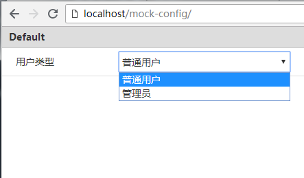

# mock-middleware

mock-middleware 是支持动态“场景切换”的 mock 中间件。

## mock 中间件

作为基于 Express 的 mock 中间件，mock-middleware 可以和 webpack-dev-middleware、webpack-hot-middleware 等一起组建本地开发服务器，mock-middleware 提供接口本地 mock 服务，例如：

```javascript
const express = require('expresss')
const compiler = webpack(require('./webpack.config'))

const app = express()
app.use(require('luobo-mock-middleware')())
app.use(require('webpack-dev-middleware')(compiler))
app.use(require('webpack-hot-middleware')(compiler))

app.listen('80')
```

然后就可以在项目的 mock 目录下，根据接口地址来配置 mock 模块。

例如，接口 `/common/userInfo` 对应的模块为 `mock/common/userInfo`：

```javascript
// mock/common/userInfo.js
module.exports = (req, res, next) => {
  res.json({userName: 'luobotang', type: 'developer'})
}
```

这样在本地服务启动后，请求接口 `/common/userInfo` 后，mock-middleware 会调用上面的模块并执行，最终请求返回配置的 JSON 数据。

如果 mock 模块进行了修改，也无需重新启动本地服务，mock-middleware 在启动后会监听 mock 目录下的文件变动，模块修改后会清除对应模块缓存。

## 动态“场景切换”

还是上面的 `/common/userInfo` 接口，在特定场景下，需要返回不同的数据（例如管理员用户数据），以验证前端页面的展示逻辑，可以手动修改 mock 模块内容：

```javascript
// mock/common/userInfo.js
module.exports = (req, res, next) => {
  res.json({userName: 'huanggua', type: 'admin'})
}
```

这样做的坏处是，每次都要手动修改 mock 模块文件内容，比较麻烦，而且这些常用的“场景”没有记录下来，其他开发者也需要手动修改。

mock-middleware 支持在 mock 目录下创建 `config.js` 文件，根据需要进行配置，例如：

```javascript
// mock/config.js
module.exports = {
  UserType: {
    desc: '用户类型',
    options: {Normal: '普通用户', Admin: '管理员'}
  }
}
```

这样，在 mock 模块中可以根据这里的配置项分别返回不同数据：

```javascript
// mock/common/userInfo.js
module.exports = (req, res, next) => {
  if (req.$config.UserType === 'Admin') {
    res.json({userName: 'huanggua', type: 'admin'})
  } else {
    res.json({userName: 'luobotang', type: 'developer'})
  }
}
```

可以通过 `/mock-config/` 页面动态切换用户类型：



通过这种方式，可以将各种场景预先配置到项目中，在页面调试时动态切换。

## 更多特性

- 自定义mock模块路径

  可以通过 `mock/map.js` 配置接口对应 mock 模块。
  
  例如：

  ```javascript
  // mock/map.js
  module.exports = {
    '/foo': 'bar'
  }
  ```

  不在 map.js 中配置的接口，按路径进行匹配查找。

- 自定义辅助方法

  可以通过 `mock/plugins.js` 配置工具方法等，提供给 mock 模块使用。

  例如：

  ```javascript
  // mock/plugins.js
  module.exports = (mock) => {
    mock.success = (data) => {
      return {
        code: '0000',
        data,
        result: 'success'
      }
    }
    mock.fail = (code = '9999') => {
      return {
        code,
        result: 'fail'
      }
    }
  }
  ```

  在 mock 模块中通过 `req.$mock` 引用辅助方法：

  ```javascript
  module.exports = (req, res, next) => {
    if (req.query.userId) {
      res.json(req.$mock.success({userId: req.query.userId}))
    } else {
      res.json(req.$mock.fail('4001'))
    }
  }
  ```

- 同步更新模块

  mock 目录下的所有文件，包括 mock 模块以及 config.js、map.js、plugins.js 配置文件，变更后都会及时同步，无需重启开发服务器。

## 更新记录

- v1.0.1

  - 修复bug
  - 更新 mock-config 页面样式

- v1.0.0

  - 支持不提供 config.js、map.js 配置文件
  - 修改 map.js 结构和使用方式，不区分 page 和 ajax
  - 修改 mock 模块返回函数时的调用逻辑，统一以 `(req, res, next) => {}` 形式进行调用

- v0.3.1

  - 支持自定义 mock plugins，在 mock 模块中通过 req.$mock 引用注入的插件方法/属性

- v0.3.0

  - 支持通过请求地址匹配的 mock 模块，并拥有更大的自由度
  - 支持 Map 形式配置选项
  - 优化 mock 模块更新，由每次请求前清除模块缓存改为监听文件变更清除缓存
